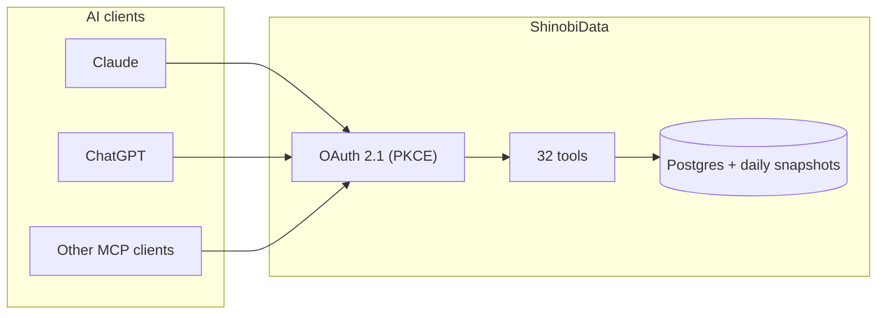

# ShinobiData

<picture>
  <source media="(prefers-color-scheme: dark)" srcset="assets/logo-dark.svg">
  
</picture>

Hook your AI client up to a real portfolio analyst. 32 tools for portfolio tracking, performance against benchmarks, fundamentals, sector and market views, screening, news. US equities, OAuth, free.

Works with Claude Desktop, ChatGPT (Plus / Teams / Enterprise), and any other MCP client.

[](https://registry.modelcontextprotocol.io/?search=shinobidata)
[](https://code.claude.com/docs/en/discover-plugins)
[](LICENSE)
[](https://github.com/dark-horse-stocks/shinobidata/discussions)

[English](README.md) · [日本語](README.ja.md) · [한국어](README.ko.md) · [Tiếng Việt](README.vi.md)

---

## What you can ask it

The AI does the orchestration. You ask the question.

- "How concentrated am I in tech?"
- "Did my portfolio beat the S&P this year?"
- "Compare AAPL, MSFT, NVDA, GOOGL, META on valuation and growth."
- "Is AAPL cheap vs its 10-year history?"
- "Which earnings reports are coming up next 14 days, mid-cap and above?"
- "Who's stagnating in my book and why?"

Each question turns into 1 to 4 tool calls. The AI narrates. The data is real and cited.

## Install

### Claude Code

```shell
/plugin marketplace add dark-horse-stocks/shinobidata
/plugin install shinobidata@shinobidata
```

That's the whole install. The first tool call opens an OAuth consent screen. Sign in with Google, click Allow, you're done. Run `/reload-plugins` to activate without restarting.

Plugin source lives in [`plugins/shinobidata/`](plugins/shinobidata/).

### Claude Desktop

Edit `~/Library/Application Support/Claude/claude_desktop_config.json`:

```json
{
  "mcpServers": {
    "shinobidata": {
      "command": "npx",
      "args": ["-y", "mcp-remote", "https://mcp.shinobidata.com/api/mcp/mcp"]
    }
  }
}
```

Quit Claude (Cmd-Q, not just the window). Reopen. The OAuth flow runs once. Sign in with Google. That's it.

### ChatGPT

Settings → Connectors → Add Custom → paste `https://mcp.shinobidata.com/api/mcp/mcp` → authorize.

In Deep Research mode it picks up `search` and `fetch` automatically.

### Anything else

Streamable HTTP, OAuth 2.1 with PKCE. Point your client at `https://mcp.shinobidata.com/api/mcp/mcp` and it figures the rest out from the well-known endpoints.

Trouble? See [docs/installation.md](docs/installation.md) for the full walkthrough or [docs/troubleshooting.md](docs/troubleshooting.md) for the usual gotchas.

## What's in there

32 tools. Five buckets.

| Group | Tools | Scope |
|---|---:|---|
| Portfolio CRUD | 6 | `portfolio:write` |
| Portfolio analytics | 6 | `portfolio:read` |
| Single-company research | 7 | `market:read` |
| Market and sector | 10 | `market:read` |
| Discovery (`screen`, `search`, `fetch`) | 3 | `market:read` |

You only grant the scopes you want at the consent screen. Want it just for research and not let the AI touch your portfolio? Skip `portfolio:write`. Done.

Full per-tool catalog in [docs/tools.md](docs/tools.md).

## Try it

After installing, paste this:

```
Create a portfolio called "Test". Then add these holdings:

Symbol, Quantity, AvgCost
AAPL, 25, 180
NVDA, 50, 75
JPM, 25, 200
KO, 70, 60
PLTR, 80, 18

Now give me a full overview, then tell me which holdings are stagnating
and how concentrated I am sector-wise.
```

That hits 6 tools (`create_portfolio`, `parse_portfolio_text`, `add_holdings`, `get_portfolio_overview`, `get_growth_vs_stagnant`, `get_risk_summary`). More prompts in [examples/prompts.md](examples/prompts.md).

## How it works



Two design choices that matter.

**Server aggregates, AI narrates.** A 200-stock portfolio question returns the same JSON shape as a 5-stock one. Postgres does the heavy lifting overnight; the AI doesn't loop over rows. Most analytics calls return in under a second.

**OAuth 2.1 end-to-end.** No API keys in your config. PKCE S256 mandatory. Refresh tokens rotate. Tokens stored as SHA-256 hashes, never plaintext. Revoke from your account whenever you want.

Architecture writeup with the OAuth sequence diagram, the constant-size-response reasoning, and the RFCs we follow: [docs/architecture.md](docs/architecture.md).

## How it's different from a yfinance / alpha-vantage MCP

If you just need price data piped to an LLM, the simple MCPs work fine. ShinobiData is heavier on the portfolio side and on the "what's the right next question" side.

- Portfolios with proper P&L tracking, performance vs benchmarks, dividend tracking, transactions. Most finance MCPs are read-only on quotes.
- Server-side aggregation. Ask "how concentrated am I" and the answer comes back in one call regardless of holdings count.
- ChatGPT Deep Research built in (`search` and `fetch` named per spec).
- OAuth instead of shared API keys.
- Quality scores: Piotroski, Altman Z, Beneish M, Magic Formula, Sloan-style cash. Not just raw numbers.

Comparison reflects v1.0 (May 2026). Other MCPs evolve fast. PRs to update this welcome.

## Roadmap

Already shipped:

- 32 tools, OAuth 2.1, ChatGPT compat
- Listed in the MCP Registry as `com.shinobidata/research`
- Privacy + terms with MCP-specific clauses

Up next:

- Public install landing page at `shinobidata.com/mcp`
- Anthropic + OpenAI directory listings (the registry one is live)
- Margin-trend in `analyze_portfolio_fundamentals`
- Strict held-on-ex-date dividend math (current version is the Robinhood-style approximation)

Down the line:

- Multi-currency
- International equities (US-only today)
- Hosted `web_search` that fans out to Claude / Gemini / Perplexity
- Bigger portfolio caps for power users

[Issues](https://github.com/dark-horse-stocks/shinobidata/issues) for bugs and tracked features. [Discussions](https://github.com/dark-horse-stocks/shinobidata/discussions) for ideas.

## Privacy and security

Short version:

- OAuth tokens are SHA-256 hashed at rest. Refresh tokens rotate; old ones are revoked the moment a new pair issues.
- Authorization codes are single-use, 10-minute TTL.
- PKCE S256 is mandatory. Plain PKCE is rejected per OAuth 2.1.
- Audit logs of tool calls are kept 90 days. Arguments are redacted before write.
- Per-token rate limits. We can revoke an abusive token without notice.

Long version: <https://shinobidata.com/en/legal/privacy-policy> · <https://shinobidata.com/en/legal/terms>

## Help / contributing

Bug? [Bug template](https://github.com/dark-horse-stocks/shinobidata/issues/new?template=bug.yml).

Want a tool that doesn't exist yet? Start in [Discussions → Ideas](https://github.com/dark-horse-stocks/shinobidata/discussions/categories/ideas). Most tools that ship come from a real question someone tried to ask Claude or ChatGPT and couldn't.

Stuck installing? [Discussions → Q&A](https://github.com/dark-horse-stocks/shinobidata/discussions/categories/q-a) or email <support@shinobidata.com>.

Translations and doc fixes are very welcome. The bar is "useful for a real reader", not perfect. See [CONTRIBUTING.md](CONTRIBUTING.md).

## License

MIT for everything in this repo (docs, examples, configs). Brand assets in `assets/` are not MIT, see [`assets/README.md`](assets/README.md). The MCP server itself is hosted at `mcp.shinobidata.com`; the production codebase stays closed during alpha.
