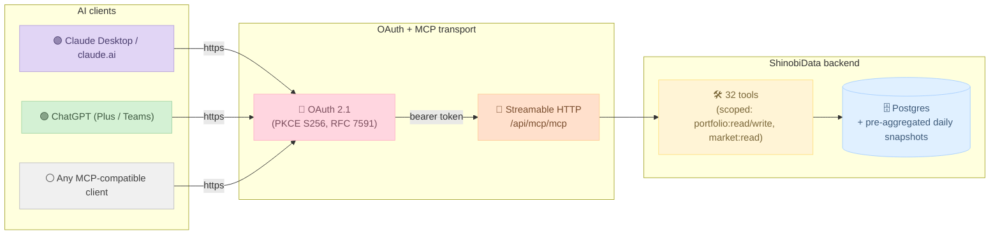

<div align="center">

<picture>
  <source media="(prefers-color-scheme: dark)" srcset="assets/logo-light.svg">
  
</picture>

# ShinobiData

**Portfolio analytics + 360° US-equity research, in your AI client.**

32 OAuth-protected tools. Works in Claude, ChatGPT, and any MCP-compatible client.

[](https://registry.modelcontextprotocol.io/?search=shinobidata)
[](LICENSE)
[](#roadmap)
[](https://github.com/niyamvora/shinobidata/discussions)

🌐  **English**  ·  [日本語](README.ja.md)  ·  [한국어](README.ko.md)  ·  [Tiếng Việt](README.vi.md)

</div>

---

> [!note]
> **Hero demo (60-second clip).** A user asks Claude *"How concentrated am I in tech?"* and watches Claude orchestrate `get_portfolio_overview` → `get_risk_summary` → narrate. *(GIF placeholder — capture coming soon. Want to help? See [#1](https://github.com/niyamvora/shinobidata/issues/1).)*

## What is ShinobiData?

A **Model Context Protocol (MCP)** server that turns your AI client into a portfolio analyst and US-equity research assistant. Connect once, and ask questions like:

- *"How is my portfolio doing? Which holdings are stagnating?"*
- *"Did I beat the S&P over the last year?"*
- *"Compare AAPL, MSFT, NVDA, GOOGL, META on valuation, growth, quality."*
- *"Is AAPL cheap or expensive vs its 10-year history?"*
- *"What earnings are coming up next 14 days for my mid-cap holdings?"*

The AI orchestrates the tools, narrates the results, and cites the data. You get the answer. No copy-paste from a spreadsheet, no separate dashboard.

## Quick install

### Claude Desktop

Add to `~/Library/Application Support/Claude/claude_desktop_config.json`:

```json
{
  "mcpServers": {
    "shinobidata": {
      "command": "npx",
      "args": ["-y", "mcp-remote", "https://mcp.shinobidata.com/api/mcp/mcp"]
    }
  }
}
```

Restart Claude Desktop. The OAuth consent screen pops; sign in with Google. Done.

### ChatGPT (Plus / Teams / Enterprise)

Settings → **Connectors** → **Add Custom** → paste `https://mcp.shinobidata.com/api/mcp/mcp` → authorize.

Once authorized, ChatGPT's Deep Research mode picks up `search` + `fetch` automatically.

### Any other MCP-compatible client

Use the connector URL directly: `https://mcp.shinobidata.com/api/mcp/mcp`. Streamable HTTP transport, OAuth 2.1 with PKCE.

For the full step-by-step walkthrough including screenshots, see [`docs/installation.md`](docs/installation.md).

---

## Demo prompts

Once installed, paste these into Claude or ChatGPT to exercise the surface:

<details>
<summary><strong>Set up a test portfolio</strong></summary>

```
1. Create a portfolio called "Test Portfolio".
2. Parse this and add the holdings:
   Symbol, Quantity, AvgCost
   AAPL, 25, 180
   MSFT, 30, 350
   NVDA, 50, 75
   JPM, 25, 200
   JNJ, 30, 160
   KO, 70, 60
```
</details>

<details>
<summary><strong>Portfolio analytics (6 tools)</strong></summary>

```
3. How is my portfolio doing? Give me the full overview.
4. Which holdings are growing fastest, and which are stagnating?
5. Run a fundamentals analysis on my portfolio.
6. Did my portfolio beat the S&P 500 over the last year?
7. How much dividend income did I get over the past year?
8. How risky is my portfolio? Any concentration concerns?
```
</details>

<details>
<summary><strong>Single-company research (7 tools)</strong></summary>

```
9.  Search for companies with "data" in the name.
10. Give me a snapshot of NVDA.
11. Show me Apple's last 5 years of income statements.
12. What are NVDA's growth stats across all horizons?
13. Who are AAPL's peers in the same industry?
14. What do analysts think about MSFT right now?
15. Show me NVDA's price history from 2025-01-01 to 2025-06-01.
```
</details>

<details>
<summary><strong>360° market & sector (10 tools)</strong></summary>

```
16. What's the US market doing today?
17. Give me an overview of the TECHNOLOGY sector.
18. Drill into the SEMICONDUCTORS industry specifically.
19. Compare AAPL, MSFT, NVDA, GOOGL, and META side by side.
20. Who are today's top movers (1d window)?
21. What earnings reports are coming up between today and 14 days out?
22. Show me upcoming ex-dividend dates for the next 30 days.
23. Is AAPL cheap or expensive vs its own 5- and 10-year history?
24. Get the quality scores for AAPL, NVDA, JPM, JNJ, MSFT.
25. What's the news sentiment on NVDA right now?
```
</details>

<details>
<summary><strong>Discovery (3 tools, ChatGPT-compat)</strong></summary>

```
26. Screen for technology stocks with P/E < 30 and Piotroski >= 7.
27. (ChatGPT Deep Research) Pick a few US stocks with strong revenue growth and reasonable valuation.
```
</details>

Full demo gallery with sample answers: [`examples/prompts.md`](examples/prompts.md).

---

## Tool catalog (32 tools, OAuth-scoped)

| Group | Count | Scope | What's in it |
|---|---:|---|---|
| **Portfolio CRUD** | 6 | `portfolio:write` | create / add holdings (CSV-aware) / parse text / add transaction / update / delete |
| **Portfolio analytics** | 6 | `portfolio:read` | overview · performance vs SPY/QQQ · risk + concentration · dividends · fundamentals · growth-vs-stagnant |
| **Single-company research** | 7 | `market:read` | search · snapshot · financials · growth stats · peers · analyst view · price history |
| **360° market & sector** | 10 | `market:read` | compare · sector / industry / market overviews · top movers · earnings + dividend calendars · valuation history · quality scores · news sentiment |
| **Discovery** | 3 | `market:read` | screen (cursor-paginated DSL) · `search` + `fetch` (ChatGPT deep-research compat) |

Full per-tool breakdown with arguments + response shapes: [`docs/tools.md`](docs/tools.md).

---

## Architecture



Two design rules drive the surface:

1. **Server-side aggregation, constant-size responses.** A 200-stock portfolio question returns the same response shape as a 5-stock question. The database does the heavy lifting; the AI does the narration. (See [§6.6 of the design doc](docs/architecture.md#why-our-analytics-tools-dont-paginate) for the full reasoning.)
2. **Pre-aggregated daily snapshots.** `CompanyReturnSnapshot` and `PortfolioReturnSnapshot` are populated overnight, so analytics tools return in p50 ~700ms / p99 ~1200ms today (caching planned to bring p50 to ~200ms).

More: [`docs/architecture.md`](docs/architecture.md).

---

## How ShinobiData compares

| | ShinobiData | Typical finance MCPs |
|---|---|---|
| **Authentication** | OAuth 2.1 with PKCE end-to-end; refresh-token rotation; revocable from account | Often shared API keys in user config |
| **Portfolio support** | First-class — create, hold, track P&L, performance vs benchmarks, dividend tracking, transactions | Often missing or read-only |
| **Aggregation** | Server-side; constant-size responses regardless of holdings count | Often per-row, AI loops + counts |
| **ChatGPT deep-research** | `search` + `fetch` named per spec, returning canonical shapes | Often missing |
| **Scope model** | 3 scopes (`portfolio:read`, `portfolio:write`, `market:read`) — least-privilege | Often single token, no scoping |
| **Discoverability** | MCP Registry (`com.shinobidata/research`), Anthropic + OpenAI directory submissions | Varies |
| **Quality / fundamentals scores** | Piotroski F + Altman Z + Beneish M + Magic Formula + Sloan-style cash | Often raw numbers only |
| **Pricing** | Free for all users (v1; 2 portfolios per user) | Varies |

> Disclaimer: comparison reflects ShinobiData's positioning as of v1.0.0 (May 2026). Other MCPs evolve fast — check their READMEs for current state. PRs to update this table welcome.

---

## Roadmap

| When | What |
|---|---|
| **Now** | 32 tools live · OAuth 2.1 · ChatGPT deep-research compat · MCP Registry listed |
| Next | Public install landing page (`shinobidata.com/mcp`) · directory listing in Anthropic + OpenAI · expanded tool descriptions |
| Soon | Margin trend in `analyze_portfolio_fundamentals` · strict held-on-ex-date dividend computation · multi-currency support · larger portfolio cap |
| Later | International equities (currently US-only) · web search backend integration (`web_search` tool fanning out to Claude/Gemini/Perplexity) · richer charting in `get_portfolio_performance` |

Open issues + feature requests: [Issues](https://github.com/niyamvora/shinobidata/issues). Discussion: [Discussions](https://github.com/niyamvora/shinobidata/discussions).

---

## Privacy + security

- **OAuth tokens** are SHA-256 hashed at rest, never plaintext.
- **Refresh-token rotation** per RFC 6749 §10.4 — old token revoked the moment a new pair issues.
- **Single-use authorization codes** (10 minute TTL).
- **PKCE S256 mandatory**; `plain` rejected per OAuth 2.1.
- **Audit logs** retained 90 days for security monitoring; arguments redacted of secrets.
- **Per-token rate limits** to prevent abuse.

Full privacy policy: <https://shinobidata.com/en/legal/privacy-policy>
Full terms of service: <https://shinobidata.com/en/legal/terms>

---

## Community

- 🐛 **Bug?** [File an issue](https://github.com/niyamvora/shinobidata/issues/new/choose).
- 💡 **Tool request?** [Discussions → Ideas](https://github.com/niyamvora/shinobidata/discussions/categories/ideas).
- 🙋 **Stuck installing?** [Discussions → Q&A](https://github.com/niyamvora/shinobidata/discussions/categories/q-a) or check [`docs/troubleshooting.md`](docs/troubleshooting.md).
- 📬 **Email**: [support@shinobidata.com](mailto:support@shinobidata.com)

Contributions welcome — see [`CONTRIBUTING.md`](CONTRIBUTING.md). For docs / examples / translations the bar is "useful and accurate" not "perfect"; we'd rather merge a draft and iterate.

---

## License

MIT for everything in this docs / examples / assets repository — see [`LICENSE`](LICENSE).

The MCP server itself runs as a hosted service at `https://mcp.shinobidata.com`; the production codebase is closed during early access.
