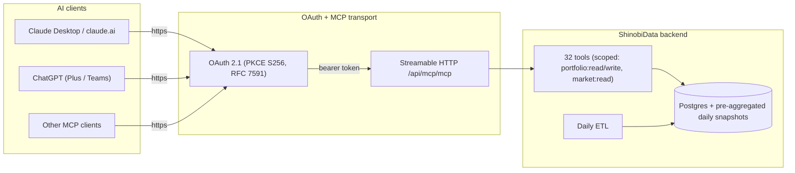
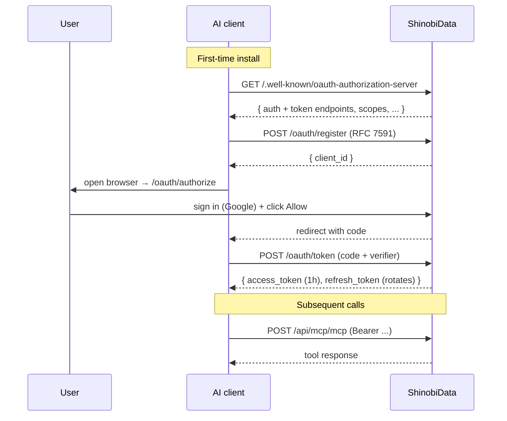

# Architecture

Design notes on how ShinobiData is put together: the protocol surface, the data flow, and the two design choices that drive the rest.

## High level



Hosted service. Users don't run anything locally. The MCP endpoint at `https://mcp.shinobidata.com/api/mcp/mcp` is publicly reachable; OAuth gates per-tool access.

## OAuth flow

OAuth 2.1 with PKCE S256. No shared secrets in user config.



Things worth knowing:

- Refresh tokens rotate on every use. The previous one is revoked the moment a new pair issues (RFC 6749 §10.4).
- Authorization codes are single-use, 10-minute TTL. Atomic CAS on consumption.
- Tokens stored as SHA-256 hashes. Never plaintext.
- Three scopes (`portfolio:read`, `portfolio:write`, `market:read`). Users can deny any of them at the consent screen and still partially install.

## Why analytics tools don't paginate

Heavy lifting belongs in SQL, not in the model's context.

If a tool returned 10 rows per call and you had a 200-holding portfolio, the AI would call the tool 20 times and stitch results together. Mechanically it works. In practice it's the wrong design.

What it costs:

- 20 round trips × ~2-3s each = 40-60s of latency before analysis starts.
- ~12,000 tokens of raw data in context just to load.
- The AI does the math itself on 200 rows. Models miscount, hallucinate sums, lose accuracy.

What we do instead. Server aggregates, returns a summary:

```json
{
  "totalHoldings": 200,
  "buckets": {
    "accelerating": 47,
    "growing": 120,
    "stable": 18,
    "stagnant": 12,
    "declining": 3
  },
  "topGrowing": ["NVDA", "MSFT", "AAPL", "..."],
  "topStagnating": ["XOM", "T", "..."],
  "weightedRevenueCagr5y": 14.2,
  "asOf": "2026-05-06"
}
```

Roughly 500 bytes regardless of portfolio size. One tool call. Constant cost.

| Tool type | Row cap | Why |
|---|---|---|
| Portfolio analytics | None, server aggregates | One summary covers any portfolio size |
| Market / sector | None, server aggregates | Same |
| Multi-company comparisons (`compare_companies`) | 5 | Past 5, AI struggles to narrate |
| Detail tools (`get_company_snapshot`, `get_financials`) | 1 company per call | Detail is intentionally per-company |
| Cursor-paginated (`screen`, `get_top_movers`) | 50 / page with `nextCursor` | True listing case |

Real flow for a 200-stock portfolio question:

```mermaid
sequenceDiagram
    participant U as User
    participant C as Claude
    participant M as ShinobiData

    U->>C: "Analyze my 200-stock portfolio"
    C->>M: analyze_portfolio_fundamentals({ portfolioId })
    Note over M: Postgres aggregates<br/>all 200 holdings server-side
    M-->>C: { buckets, topGrowing, topStagnating, weighted CAGRs }
    Note over C: 12 are stagnating;<br/>picks worst 3 to investigate
    C->>M: get_company_snapshot({ symbol: "XOM" })
    M-->>C: full XOM detail
    C->>M: get_company_snapshot({ symbol: "T" })
    M-->>C: full T detail
    C-->>U: Coherent narrative answer
```

4 round trips for 200 holdings, not 20.

## Pre-aggregated daily snapshots

A daily ETL refreshes:

- `CompanyReturnSnapshot` — period returns + price CAGRs + volatility + max drawdown + Sharpe per company.
- `CompanyScreeningSnapshot` — denormalized fundamentals (~650 fields) per company, latest annual.
- `PortfolioReturnSnapshot` — time-weighted returns + benchmark deltas vs SPY/QQQ + risk metrics per portfolio.

These pre-computations are why analytics tools return in p50 ~700ms / p99 ~1200ms, and why response shapes stay constant.

## Data conventions

- US equities only (v1).
- USD only (v1).
- Growth values are percentages (10 = 10%) where the response includes a `units.growth` note. Returns are decimals (0.10 = 10%) elsewhere. Always check the per-tool `units` block.
- Every response includes envelope `dataAsOf` (wallclock) plus a per-tool `snapshotAsOf` (underlying data freshness). Distinct on purpose.
- Every response includes a `dataSources` array so AI clients can cite provenance.

## Standards

- [RFC 6749](https://www.rfc-editor.org/rfc/rfc6749) — OAuth 2.0
- [RFC 7591](https://www.rfc-editor.org/rfc/rfc7591) — Dynamic Client Registration
- [RFC 7636](https://www.rfc-editor.org/rfc/rfc7636) — PKCE
- [RFC 8414](https://www.rfc-editor.org/rfc/rfc8414) — OAuth 2.0 Authorization Server Metadata
- [RFC 9728](https://www.rfc-editor.org/rfc/rfc9728) — OAuth 2.0 Protected Resource Metadata
- [Model Context Protocol](https://modelcontextprotocol.io)
- ChatGPT deep-research connector spec (`search` + `fetch` shapes)
